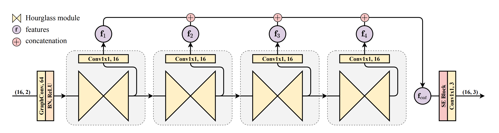

# Graph Stacked Hourglass Network (CVPR 2021)
<a href="https://hits.seeyoufarm.com"></a>
</a>

<p align="center"></p>


This repository contains the pytorch implementation of the approach described in the paper:
> Tianhan Xu and Wataru Takano. 
[Graph Stacked Hourglass Networks for 3D Human Pose Estimation](https://arxiv.org/pdf/2103.16385.pdf)
Proceedings of the IEEE/CVF Conference on Computer Vision and Pattern Recognition (CVPR), 2021, pp. 16105-16114


```
@InProceedings{Xu_2021_CVPR,
    author    = {Xu, Tianhan and Takano, Wataru},
    title     = {Graph Stacked Hourglass Networks for 3D Human Pose Estimation},
    booktitle = {Proceedings of the IEEE/CVF Conference on Computer Vision and Pattern Recognition (CVPR)},
    month     = {June},
    year      = {2021},
    pages     = {16105-16114}
}
```

## Introduction

We evaluate models for 3D human pose estimation on the [Human3.6M Dataset](http://vision.imar.ro/human3.6m/).

In this repository, only 2D joints of the human pose are exploited as inputs. We utilize the method described in Pavllo et al. [2] to normalize 2D and 3D poses in the dataset. To be specific, 2D poses are scaled according to the image resolution and normalized to [-1, 1]; 3D poses are aligned with respect to the root joint. Please refer to the corresponding part in Pavllo et al. [2] for more details. For the 2D ground truth, we predict 16 joints (as the skeleton in Martinez et al. [1] and Zhao et al. [3] without the 'Neck/Nose' joint). For the 2D pose detections, the 'Neck/Nose' joint is reserved. 


## Quickstart

This repository is build upon Python v3.8 and Pytorch v1.9.0 on Ubuntu 20.04 LTS. All experiments are conducted on a single NVIDIA RTX 3090 GPU. See [`requirements.txt`](requirements.txt) for other dependencies. We recommend installing Python v3.78 from [Anaconda](https://www.anaconda.com/) and installing Pytorch (>= 1.9.0) following guide on the [official instructions](https://pytorch.org/) according to your specific CUDA version. Then you can install dependencies with the following commands.

```
git clone https://github.com/tamasino52/GraphSH.git
cd GraphSH
pip install -r requirements.txt
```

### Benchmark setup
CPN 2D detections for Human3.6M datasets are provided by [VideoPose3D](https://github.com/facebookresearch/VideoPose3D) Pavllo et al. [2], which can be downloaded by the following steps:

```
cd data
wget https://dl.fbaipublicfiles.com/video-pose-3d/data_2d_h36m_cpn_ft_h36m_dbb.npz
wget https://dl.fbaipublicfiles.com/video-pose-3d/data_2d_h36m_detectron_ft_h36m.npz
cd ..
```

3D labels and ground truth can be downloaded
```
cd data
gdown --id 1P7W3ldx2lxaYJJYcf3RG4Y9PsD4EJ6b0
cd ..
```

### GT setup 

GT 2D keypoints for Human3.6M datasets are obtained from [SemGCN](https://github.com/garyzhao/SemGCN) Zhao et al. [3], which can be downloaded by the following steps:
```
cd data
pip install gdown
gdown https://drive.google.com/uc?id=1Ac-gUXAg-6UiwThJVaw6yw2151Bot3L1
python prepare_data_h36m.py --from-archive h36m.zip
cd ..
```
After this step, you should end up with two files in the dataset directory: data_3d_h36m.npz for the 3D poses, and data_2d_h36m_gt.npz for the ground-truth 2D poses.

### GT Evaluation 
```
python main_gcn.py --gcn {gcn_name}  --evaluate checkpoint/{weight_name}.pth.tar
```

### GT Training 
```
# Decoupled Vanilla GCN (What method used in paper)
python main_gcn.py --gcn dc_vanilla

# Decoupled Pre-Aggresive GCN (What method used in paper)
python main_gcn.py --gcn dc_preagg

# Semantic GCN (What method used in paper)
python main_gcn.py --gcn semantic

# Decoupled Post-Aggresive GCN
python main_gcn.py --gcn dc_postagg

# Convolution-style GCN
python main_gcn.py --gcn convst

# No-sharing GCN
python main_gcn.py --gcn nosharing

# Modulated GCN
python main_gcn.py --gcn modulated
```

### Training 

```
# Decoupled Vanilla GCN
python main_gcn.py --gcn dc_vanilla --keypoints cpn_ft_h36m_dbb

# Decoupled Pre-Aggresive GCN
python main_gcn.py --gcn dc_preagg --keypoints cpn_ft_h36m_dbb
```

### Pre-trained weight
I implemented and tested all the elements proposed in this paper, but failed to reach the benchmark score presented in the paper. Instead, I uploaded a good enough one, so use it if you need it.

[Download Link.](https://drive.google.com/file/d/1FQpAnNyycKXgqlJ7vitFgP7KDwD365sQ/view?usp=sharing)

### Acknowledgement
This code is extended from the following repositories.
- [3d-pose-baseline](https://github.com/una-dinosauria/3d-pose-baseline)
- [3d_pose_baseline_pytorch](https://github.com/weigq/3d_pose_baseline_pytorch)
- [VideoPose3D](https://github.com/facebookresearch/VideoPose3D)
- [Semantic GCN](https://github.com/garyzhao/SemGCN)
- [Local-to-Global GCN](https://github.com/vanoracai/Exploiting-Spatial-temporal-Relationships-for-3D-Pose-Estimation-via-Graph-Convolutional-Networks)
- [Modulated-GCN](https://github.com/ZhimingZo/Modulated-GCN)

Thank you to authors for releasing their code. Please also consider citing their works.
